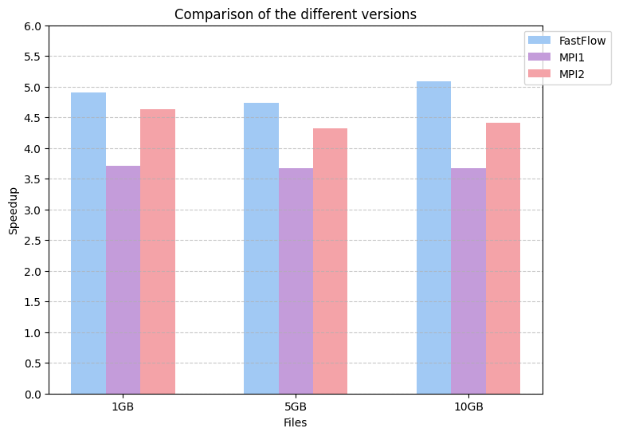

# Shared and Distributed LSH
Program which calculates Locality Sensitive Hashing similarities with different models of parallelism, using Fastflow for the Shared Memory Model and MPI for the Distributed Memory Model. More details can be found in the report.

# How to run
Position inside the "Code" directory and from cmd execute
- make all

Four executable files will be generated, for the usage:
- sequential [input_file]
- fastflow [input_file] [SizeFarm1] [SizeFarm2]
- --mpi=pmix --nodes=[nodes] mpi1 [input_file]
- --mpi=pmix --nodes=[nodes] mpi2 [input_file]

The programm will output the number of similarities and the time of computation.

# Speedup comparison

